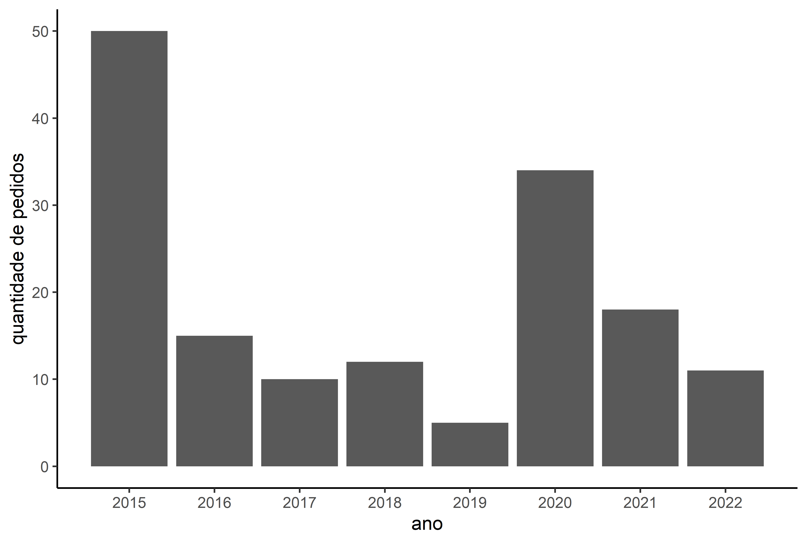

 
Uma das grandes vantagens de utilizar o R como ferramenta para a análise de dados é a possibilidade de utilizar pacotes. Os pacotes nada mais são do que um conjunto de algoritmos e/ou dados, geralmente disponibilizados em um repositório. Eles são o "padrão-ouro" do compartilhamento de conhecimento no R. 

Criar o pacote Data Access to Information Law (DAIL) foi uma forma que encontrei de tornar o processo de análise dos dados da Lei de Acesso à Informação mais prático. Ele permite baixar e realizar buscas nos dados disponibilizados pela Controladoria Geral da União (CGU) desde o ano de 2015. É uma ferramenta que permite fazer análises quantitativas e qualitativas sobre as respostas do poder público aos questionamentos da sociedade civil.  

No exemplo abaixo, apelando para o imaginário popular, vamos analisar todos os pedidos de acesso à informação sobre Objetos Voadores Não Idenficados (OVNIs), com o intuito de responder as seguintes perguntas:

- Quantos pedidos sobre o assunto foram feitos desde 2015?

- Qual foi a quantidade de pedidos realizada em cada ano?

- Quais órgãos mais receberam pedidos sobre o assunto?

- Qual foi a proporção de pedidos que tiveram o acesso concedido (mesmo que parcialmente)?


Para instalar o pacote, utilizamos o comando:

```r
install.packages('dail')

```

E então carregamos os pacotes que serão usados:

```r
library(dail)
library(dplyr)
library(ggplot2)
library(lubridate)
```
O DAIL contém apenas duas funções: requests() e appeals(). A primeira faz o download dos pedidos e a segunda realiza o download dos dados provenientes dos recursos que foram abertos (questionando as respostas dos pedidos). Por meio do argumento "search" é possível buscar por uma palavra-chave específica.  

É possível tanto fazer o download de todos os pedidos e recursos feitos de 2015 até 2022, como também executar a busca por uma palavra-chave específica dentro dos campos das perguntas ou de suas respostas.

```r
# fazer o download de todos os pedidos
requests(search = 'all') .

# fazer o download de todos os pedidos e filtrar aqueles que contenham a palavra "ovni" na pergunta.
requests(search = 'ovni') 

# fazer o download de todos os pedidos e filtrar aqueles que contenham a palavra "ovni" na resposta.
requests(search = 'ovni', answer = T) 

```

O algoritmo de busca do pacote retorna exatamente a palavra que é inserida no argumento "search", ou seja, se eu digitar a palavra "carro", a função não me retorna os pedidos que contenham as palavras "carros" ou "carroceria".
Para contornar esta limitação, foram feitas seis buscas, que no final tiveram seus resultados unificados na mesma tabela, de modo que fosse possível excluir as linhas repetidas.

Para fazer as requisições, basta rodar:

```r
busca1 <- requests(search = 'ovni')
busca2 <- requests(search = 'ovnis')
busca3 <- requests(search = 'objeto voador não identificado')
busca4 <- requests(search = 'objetos voadores não identificados')
busca5 <- requests(search = 'ufo')
busca6 <- requests(search = 'unidentified flying object')

x <- unique(rbind(busca1,busca2,busca3,busca4,busca5,busca6)) %>%
  mutate(data_registro = as_date(dmy(data_registro))) %>%
  arrange(data_registro)
```
O código acima retorna uma tabela com todos os pedidos na ordem em que foram realizados. Ao todo, foram encontrados 155 pedidos de acesso à informação sobre OVNIS de 2015 até março de 2022.

<iframe seamless src="lai_ovni.html" width="100%" height="500"></iframe>

<br>
<br>
Os anos de 2015 e 2020 registraram as maiores quantidade de pedidos, 50 e 34, respectivamente.

```r
x_anos <- x %>%
  mutate(ano = year(data_registro)) %>%
  group_by(ano) %>%
  count()

ggplot() +
  geom_bar(data = x_anos, aes(x = ano, y = n), stat = 'identity') +
  labs(y = 'quantidade de pedidos', x = 'ano') +
  scale_x_continuous(n.breaks = 8) +
  theme_classic()

```

```{r echo=FALSE, out.width="100%", fig.align="center"}


```

Ao realizar a leitura de alguns dos pedidos, a explicação para a grande quantidade de pedidos nos dois anos mencionados anteriormente deve-se ao fato de que, aparentemente, a mesma pessoa realizou uma grande quantidade de pedidos para diversas instituições, o que foi identificado pela similaridade de escrita nas perguntas enviadas. 


Sobre os órgãos que mais responderam pedidos sobre o assunto, apenas três deles concentraram 55% das solicitações recebidas no período: Comando da Aeronáutica (COMAER), Arquivo Nacional(AN) e Comando do Exército(CEX).

```r
x_orgao <- x %>%
  group_by(orgao) %>%
  count() %>%
  rename('quantidade_de_pedidos' = n) %>% 
  arrange(desc(quantidade_de_pedidos))

```

<iframe seamless src="lai_orgao.html" width="100%" height="500"></iframe>
<br>
<br>


Mesmo considerando aqueles casos em que o governo forneceu o acesso parcial aos dados, em apenas 64% das resposta foi concedido o acesso à informação.


```r
x_decisao <- x %>%
  group_by(decisao) %>%
  count() %>%
  rename('quantidade_de_pedidos' = n)
```

<iframe seamless src="lai_decisao.html" width="100%" height="500"></iframe>
<br>
<br>

Por fim, para entender os detalhes sobre o tipo de informação solicitada seria necessário verificar o conteúdo de cada um dos pedidos - e das suas respostas - por meio de uma análise qualitativa ou com a aplicação de técnicas de análise textual (também possível via linguagem R).
